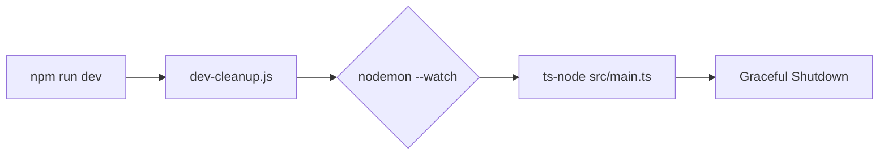

# Pusdatin NU Backend Engine

## Dev Startup Flow



### Commands

| Command | Action |
|---|---|
| `npm run dev` | Clean port → start with watch (single command) |
| `npm run dev:clean` | Kill any process occupying PORT |
| `npm run dev:bootstrap` | Start NestJS with nodemon (no cleanup) |
| `npm run start:dev` | Start once (no watch, no cleanup) |

### How it works

1. **`npm run dev`** runs `dev-cleanup.js` first, which:
   - Detects processes on `PORT` (default 3000)
   - Kills them safely (Windows: `taskkill`, Unix: `kill`)
   - Falls back to process-name kill if port detection fails
   - Falls back to `PORT+1`, `PORT+2` up to 5 attempts if port remains occupied

2. **`nodemon --exec ts-node src/main.ts`** starts the NestJS app with file-watch restart.

3. **`main.ts`** has a safety layer: if `EADDRINUSE` still occurs, it auto-increments the port (up to 5 attempts).

4. **Graceful shutdown**: SIGINT/SIGTERM handlers call `app.close()` before `process.exit()` — no zombie processes, no port leaks.

### Requirements

- Node.js >= 20
- pnpm >= 9
- PostgreSQL with PostGIS

### Quick start

```bash
pnpm install
cp .env.example backend/.env  # edit as needed
cd backend
npm run dev
```
