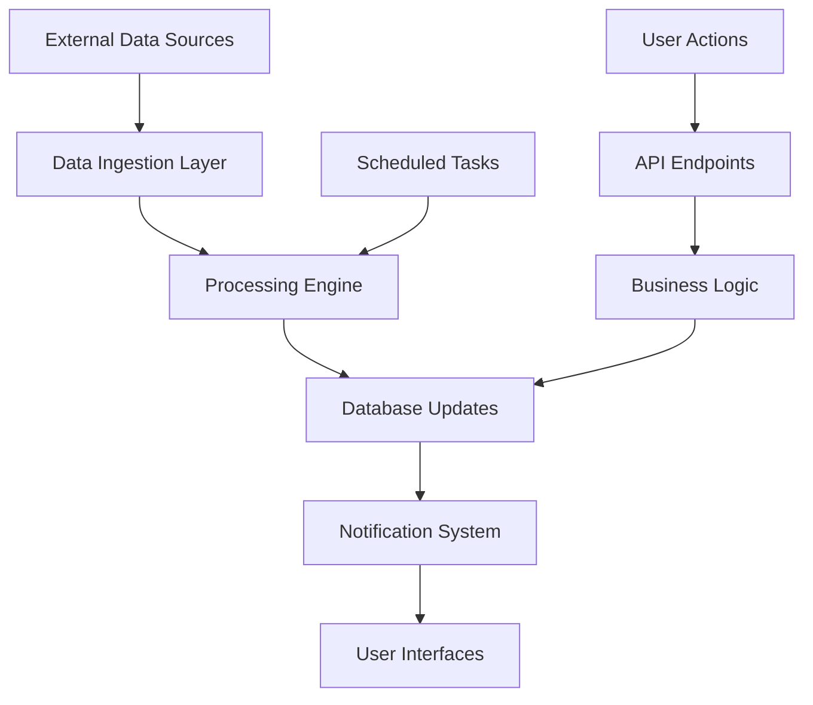

# T01 - Agent Capability Assessment

**Task**: Analyze existing system capabilities and define integration patterns for future automation

**Detailed Assessment Steps**:

1. **Current System Capability Analysis**:

**Incident Processing Capabilities**:
```js
// Current manual processes that could be enhanced
const incidentProcessingCapabilities = {
  data_entry: {
    current: "Manual form submission via /api/incidents",
    inputs: ["title", "disaster_type", "coordinates", "description", "photo"],
    validation: "Basic field validation only",
    enhancement_potential: "Auto-categorization, coordinate validation, duplicate detection"
  },
  
  priority_scoring: {
    current: "Manual assessment via PATCH /api/incidents/:id/assessment", 
    inputs: ["dampak_manusia", "dampak_rumah", "dampak_fasum", "dampak_vital"],
    calculation: "AI scoring weights from mainprd.md",
    enhancement_potential: "Automated scoring based on description and images"
  },
  
  status_workflow: {
    current: "Manual status updates: REPORTED → VERIFIED → ASSESSED → COMMANDED → ACTION → COMPLETED",
    triggers: "Manual user actions",
    enhancement_potential: "Automated transitions based on conditions"
  },
  
  volunteer_assignment: {
    current: "Manual deployment via volunteer_deployments table",
    matching: "Manual selection by region and expertise",
    enhancement_potential: "Optimized matching algorithm"
  }
};
```

**Data Collection Capabilities**:
```js
const dataCollectionCapabilities = {
  news_scraping: {
    current: "5140 records in intel_news table from Detik Jateng",
    sources: ["Manual scraping results"],
    filtering: "Central Java keywords from mainprd.md",
    enhancement_potential: "Real-time multi-source scraping"
  },
  
  external_apis: {
    current: "BMKG earthquakes, RainViewer radar, NASA Himawari-9",
    refresh_rate: "5 minutes for BMKG/RainViewer",
    integration: "Frontend polling",
    enhancement_potential: "Backend processing and incident auto-creation"
  },
  
  historical_data: {
    current: "12,641 records in historical_disasters table",
    coverage: "Time-series disaster data",
    usage: "Map heatmap display",
    enhancement_potential: "Pattern analysis and prediction"
  }
};
```

2. **Integration Architecture Design**:

**Database Integration Patterns**:
```js
const databaseIntegrationPatterns = {
  read_patterns: {
    incidents: {
      tables: ["incidents", "incident_actions", "incident_instructions"],
      frequency: "Real-time for new incidents",
      filters: "Central Java bounds, status != COMPLETED"
    },
    
    volunteers: {
      tables: ["volunteers", "volunteer_deployments", "volunteer_schedules"],
      frequency: "On-demand for matching",
      filters: "status = approved, region-based"
    },
    
    intel_news: {
      tables: ["intel_news"],
      frequency: "Continuous monitoring",
      filters: "is_processed = false"
    }
  },
  
  write_patterns: {
    incident_creation: {
      tables: ["incidents"],
      fields: ["title", "disaster_type", "latitude", "longitude", "is_ai_generated"],
      validation: "Coordinate bounds, duplicate detection"
    },
    
    priority_updates: {
      tables: ["incidents"],
      fields: ["priority_score", "priority_level", "damage_score"],
      triggers: "Assessment completion"
    },
    
    audit_logging: {
      tables: ["audit_logs"],
      fields: ["action", "table_name", "record_id", "changes"],
      requirement: "All automated actions must be logged"
    }
  }
};
```

**API Integration Requirements**:
```js
const apiIntegrationRequirements = {
  existing_endpoints: {
    public_endpoints: [
      "GET /api/incidents/public - Map data access",
      "GET /api/historical-data - Historical patterns",
      "POST /api/reports - Public incident reporting"
    ],
    
    protected_endpoints: [
      "GET /api/incidents - Filtered incident access",
      "POST /api/incidents - Incident creation with photos",
      "PATCH /api/incidents/:id/assessment - Damage scoring",
      "GET /api/volunteers - Volunteer management"
    ]
  },
  
  future_automation_endpoints: {
    monitoring: [
      "GET /api/automation/status - System health check",
      "GET /api/automation/logs - Processing activity logs",
      "POST /api/automation/trigger - Manual process trigger"
    ],
    
    configuration: [
      "GET /api/automation/config - Current settings",
      "PUT /api/automation/config - Update parameters",
      "POST /api/automation/test - Test processing pipeline"
    ]
  }
};
```

3. **Workflow Automation Mapping**:

**Current Manual Workflows**:
```js
const workflowMappings = {
  incident_lifecycle: {
    steps: [
      {
        current: "User submits incident via form",
        automation_potential: "Auto-detect from news/social media",
        complexity: "Medium - requires NLP and validation"
      },
      {
        current: "Admin verifies incident details",
        automation_potential: "Auto-verify based on source credibility",
        complexity: "Low - rule-based verification"
      },
      {
        current: "Field staff conducts assessment",
        automation_potential: "Pre-assessment using satellite/drone data",
        complexity: "High - requires image analysis"
      },
      {
        current: "Commander assigns resources",
        automation_potential: "Optimize resource allocation",
        complexity: "Medium - optimization algorithm"
      }
    ]
  },
  
  volunteer_coordination: {
    steps: [
      {
        current: "Manual volunteer search by region",
        automation_potential: "Auto-match by location and skills",
        complexity: "Low - database query optimization"
      },
      {
        current: "Manual deployment notification",
        automation_potential: "Auto-notify via FCM/WhatsApp",
        complexity: "Low - existing notification system"
      },
      {
        current: "Manual status tracking",
        automation_potential: "GPS-based status updates",
        complexity: "Medium - mobile app integration"
      }
    ]
  }
};
```

4. **Data Flow Specifications**:

**Real-time Data Processing Flow**:


**Processing Pipeline Specifications**:
```js
const processingPipelines = {
  news_processing: {
    input: "Raw news articles from intel_news",
    steps: [
      "Extract location and disaster type",
      "Validate against Central Java bounds",
      "Check for duplicate incidents",
      "Calculate severity score",
      "Create incident if threshold met"
    ],
    output: "New incident record or updated intel_news.is_processed",
    frequency: "Every 5 minutes"
  },
  
  incident_scoring: {
    input: "Incident with damage assessment data",
    steps: [
      "Apply AI scoring weights from mainprd.md",
      "Calculate priority_score and damage_score",
      "Determine priority_level (CRITICAL/HIGH/MEDIUM/LOW)",
      "Trigger notifications if CRITICAL/HIGH"
    ],
    output: "Updated incident with scores and notifications",
    frequency: "On assessment completion"
  },
  
  volunteer_matching: {
    input: "New incident requiring response",
    steps: [
      "Query available volunteers in region",
      "Filter by required expertise",
      "Calculate distance and availability",
      "Rank by suitability score",
      "Send deployment notifications"
    ],
    output: "Volunteer deployment records and notifications",
    frequency: "On incident status change to COMMANDED"
  }
};
```

**Output Documentation**:

1. **capability-assessment.json** - Complete system analysis
2. **integration-patterns.json** - Database and API integration specs
3. **workflow-automation-map.json** - Current vs automated process mapping
4. **data-flow-diagram.md** - Visual process flows
5. **automation-requirements.json** - Technical requirements for future implementation

**Success Criteria**:
- All current manual processes documented and analyzed
- Integration patterns defined for database and API access
- Workflow automation potential assessed with complexity ratings
- Data flow specifications created for real-time processing
- Technical requirements documented for future implementation
- Performance benchmarks established (processing < 30 seconds per batch)
- Scalability requirements defined (handle 1000+ incidents/day)

**Estimated Time**: 10 hours
